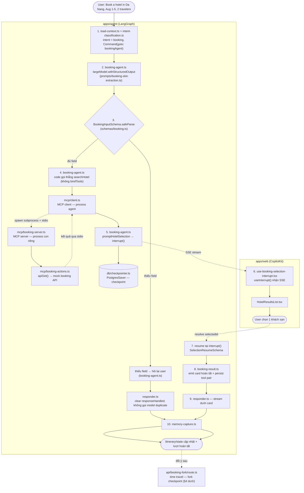
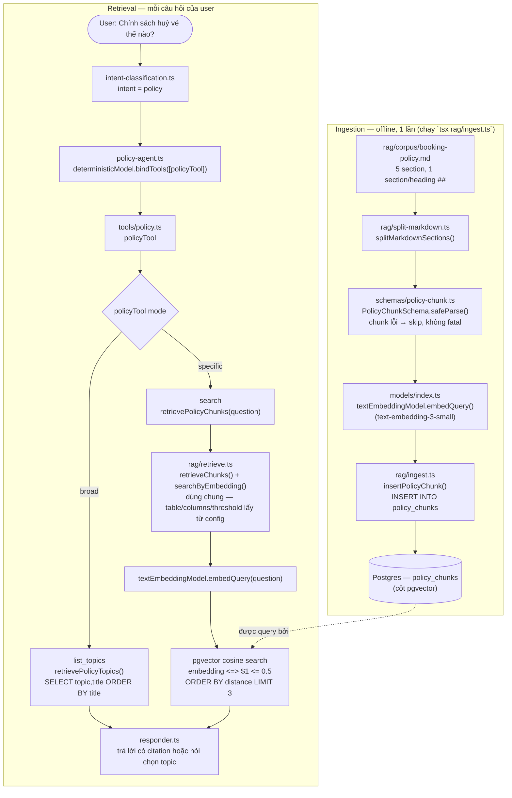
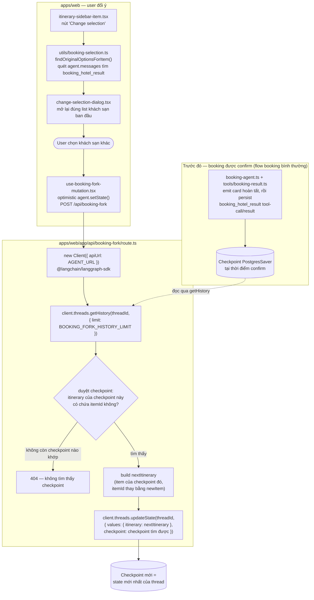

# Agent Graph Architecture

## Mục lục

- [Agent Graph Architecture](#agent-graph-architecture)
  - [Mục lục](#mục-lục)
  - [1. Vì sao tách nhiều node riêng thay vì 1 agent to duy nhất?](#1-vì-sao-tách-nhiều-node-riêng-thay-vì-1-agent-to-duy-nhất)
  - [2. Từng node: model, kiểu, tool](#2-từng-node-model-kiểu-tool)
  - [3. Flow của graph](#3-flow-của-graph)
  - [4. Memory: short-term vs long-term](#4-memory-short-term-vs-long-term)
  - [8. Threads — implement \& lưu ở đâu](#8-threads--implement--lưu-ở-đâu)
  - [9. RAG — pgvector vs keyword, node hay tool](#9-rag--pgvector-vs-keyword-node-hay-tool)
  - [10. Viết unit test (step by step)](#10-viết-unit-test-step-by-step)
  - [11. Time travel — fork lại 1 booking đã confirm](#11-time-travel--fork-lại-1-booking-đã-confirm)
  - [12. Đi từ đầu đến cuối 1 flow: booking khách sạn (map với target LangChain/LangGraph)](#12-đi-từ-đầu-đến-cuối-1-flow-booking-khách-sạn-map-với-target-langchainlanggraph)
  - [13. Known issue — HITL booking re-render sau mỗi lần select](#13-known-issue--hitl-booking-re-render-sau-mỗi-lần-select)
  - [14. Target checklist — LangChainJS \& LangGraph](#14-target-checklist--langchainjs--langgraph)
    - [LangChainJS](#langchainjs)
    - [LangGraph](#langgraph)
- [FEATURES](#features)
  - [1. Booking](#1-booking)
  - [2. RAG](#2-rag)
  - [3. Threads](#3-threads)
  - [4. Time travel](#4-time-travel)

## 1. Vì sao tách nhiều node riêng thay vì 1 agent to duy nhất?

Graph là **supervisor/router**: `intentClassification` phân loại ý định rồi `Command({ goto })`
sang 1 trong 6 node domain. Gộp thành 1 agent bind hết tool sẽ gặp:

- Model khó chọn đúng tool khi có nhiều tool mô tả gần giống nhau (routing accuracy giảm).
- `bookingAgent` cần `interrupt()` để pause/resume chờ user chọn chuyến bay/khách sạn —
  khó làm an toàn trong 1 ReAct-loop tự do.
- Mỗi domain cần model khác nhau: `bookingAgent` dùng `largeModel` (trích slot chính xác hơn),
  còn lại dùng `smallModel`.
- Mỗi domain có reducer state khác nhau (`itinerary` overwrite, `messages` concat).
- Test theo từng node độc lập dễ hơn nhiều so với 1 agent khổng lồ.

## 2. Từng node: model, kiểu, tool

Phân biệt theo việc node có cần **model ra quyết định** hay không, và nếu có thì model đó bind
tool gì.

| Node                       | Model                                      | Kiểu                                                                                       | Mô tả                                                                                                                                                                                                                                                                                                                                                                                                                                                                                                                                                                                                                                                                                                                                                                                                                                                                                                                                                    |
| -------------------------- | ------------------------------------------ | ------------------------------------------------------------------------------------------ | -------------------------------------------------------------------------------------------------------------------------------------------------------------------------------------------------------------------------------------------------------------------------------------------------------------------------------------------------------------------------------------------------------------------------------------------------------------------------------------------------------------------------------------------------------------------------------------------------------------------------------------------------------------------------------------------------------------------------------------------------------------------------------------------------------------------------------------------------------------------------------------------------------------------------------------------------------- |
| `load-context.ts`          | — (không gọi model)                        | Function thuần                                                                             | Pass `itinerary` qua nguyên trạng mỗi turn để đồng bộ state cho frontend — chỉ plumbing, không merge/validate gì                                                                                                                                                                                                                                                                                                                                                                                                                                                                                                                                                                                                                                                                                                                                                                                                                                         |
| `intent-classification.ts` | `deterministicModel` (gpt-4o-mini, temp 0) | Structured output, không `bindTools`                                                       | Phân loại message vào 1 trong 7 intent (`weather`/`places`/`booking`/`cancel`/`policy`/`memory`/`unknown`) qua `IntentSchema`, rồi `Command({ goto })`                                                                                                                                                                                                                                                                                                                                                                                                                                                                                                                                                                                                                                                                                                                                                                                                   |
| `weather-agent.ts`         | `smallModel` (gpt-4o-mini)                 | Structured destination extraction; code gọi thẳng `weatherTool`                            | Chỉ đọc `HumanMessage` mới nhất, fallback `state.destination`; thiếu destination thì dừng trước API và hỏi lại. Đủ destination thì gọi tool để UI render card, lấy ID lifecycle card làm ID của tool-call persist để snapshot reconcile tại chỗ, rồi lưu destination vào state                                                                                                                                                                                                                                                                                                                                                                                                                                                                                                                                                                                                                |
| `supervisor.ts`            | `deterministicModel` (gpt-4o-mini, temp 0) | Structured output, không `bindTools`                                                       | Chạy sau `weatherAgent` HOẶC `placesAgent`, đọc `HumanMessage` mới nhất + `state.stepsCompleted` + `state.toolResult`. Ngoại lệ duy nhất là `pendingRequest`: request weather/places đang chờ destination được giữ đúng qua lượt hỏi lại, nên câu trả lời "Paris" vẫn resume phần "nếu đẹp thì đặt vé". Không truyền full history, tránh suggestion/request cũ bị hiểu là yêu cầu hiện tại. Qua `SupervisorDecisionSchema`, node quyết định domain weather/places/booking tiếp theo; `Command({ goto, update })` handoff ngay trong lượt. Lookup thành công thì clear `pendingRequest`. Code enforce loop-guard và `bookingAgent` không quay lại supervisor, nên chain tối đa 3 hop |
| `places-agent.ts`          | `smallModel` (gpt-4o-mini)                 | Structured destination extraction; code gọi thẳng `placesTool`                             | Cùng flow validate và lifecycle-ID handoff như weather: chỉ đọc message user mới nhất, fallback state, thiếu thì hỏi trước; đủ thì code gọi places API, giữ card trước responder sau snapshot và lưu destination vào state                                                                                                                                                                                                                                                                                                                                                                                                                                                                                                                                                                                                    |
| `policy-agent.ts`          | `deterministicModel` (gpt-4o-mini, temp 0) | Agent node — bind `policyTool`                                                             | Câu hỏi cụ thể dùng mode `search`: embed + pgvector cosine search. Câu hỏi chung dùng `list_topics`: đọc `topic/title` trực tiếp từ các chunk đã ingest để hỏi user muốn xem mục nào, không hardcode category                                                                                                                                                                                                                                                                                                                                                                                                                                                                                                                                                                                                                                                                                                                                            |
| `booking-agent.ts`         | `largeModel` trích slot + `smallModel` khi thiếu field | **Không** `bindTools` — deterministic control flow                              | Có đủ field thì code gọi thẳng MCP rồi `interrupt()`. Resume xong, node gọi internal booking-result tool để lifecycle card hoàn tất xuất hiện trước responder, rồi persist cặp tool-call/result cùng ID handoff cho reload/time travel. Nếu thiếu field, node tạo đúng 1 clarification `AIMessage`, set `responseHandled`; `responder` không duplicate. `intent === 'cancel'` không gọi model; huỷ thật ở client qua itinerary                                                                                                                                                                                                                                                                                  |
| `memory-agent.ts`          | `smallModel` (gpt-4o-mini)                 | Agent node — bind 3 tool (`saveMemoryTool`, `recallMemoryTool`, `saveUserProfileTool`)     | Xử lý yêu cầu lưu/hỏi lại preference tường minh. Không `interrupt()`                                                                                                                                                                                                                                                                                                                                                                                                                                                                                                                                                                                                                                                                                                                                                                                                                                                                                     |
| `memory-capture.ts`        | `deterministicModel` (gpt-4o-mini, temp 0) | Gọi model để trích xuất, nhưng **không** `bindTools` — tự gọi thẳng tool nếu trích được gì | Chỉ quét `HumanMessage` mới nhất để tìm preference/profile fact lỡ chèn vào; chạy **sau khi `responder` hoàn tất** cho intent weather/places/booking/cancel, không chạy trước hoặc song song                                                                                                                                                                                                                                                                                                                                                                                                                                                                                                                                                                                                                                                                                                                                                             |
| `responder.ts`             | `smallModel` (gpt-4o-mini)                 | Gọi model với toàn bộ `state.messages`, không `bindTools`                                  | Viết câu trả lời cuối cho flow thường. Nếu booking đã append missing-field clarification thì chỉ clear `responseHandled`, không gọi model lần hai                                                                                                                                                                                                                                                                                                                                                                                                                                                                                                                                                                                                                                                                                                                                          |

**Tool ↔ node** (8 LangChain `tool()`; policy/memory dùng `bindTools`, weather/places,
memoryCapture và booking-result lifecycle gọi trực tiếp; cộng thêm 2 tool MCP):

| Tool                | Bind ở node                       | Gọi model hay gọi thẳng                                     |
| ------------------- | --------------------------------- | ----------------------------------------------------------- |
| `weather`           | `weatherAgent`                    | code gọi thẳng sau structured destination extraction       |
| `places`            | `placesAgent`                     | code gọi thẳng sau structured destination extraction       |
| `policy`            | `policyAgent`                     | model chọn qua `bindTools` (RAG bên trong)                  |
| `save_memory`       | `memoryAgent`, `memoryCapture`    | `memoryAgent`: model chọn; `memoryCapture`: gọi thẳng       |
| `save_user_profile` | `memoryAgent`, `memoryCapture`    | như trên                                                    |
| `recall_memory`     | `memoryAgent`                     | model chọn qua `bindTools`                                  |
| `booking_flight_result` | `bookingAgent`                | internal lifecycle tool gọi thẳng sau resume để render/persist confirmed card |
| `booking_hotel_result`  | `bookingAgent`                | như trên                                                    |
| `search_flights`    | `bookingAgent` (MCP server riêng) | gọi thẳng qua MCP client — **không** qua model tool-calling |
| `search_hotels`     | `bookingAgent` (MCP server riêng) | như trên                                                    |

`search_flights`/`search_hotels` tách MCP riêng thay vì `bindTools` vì cần deterministic control

- `interrupt()` (xem `booking-agent.ts` ở trên) — MCP còn đóng vai trò service boundary tách
  biệt logic điều phối graph khỏi call API đặt vé/khách sạn.

## 3. Flow của graph

- đầu tiền là sẽ load context
- sau đó agent sẽ dựa theo message user hỏi để pick agent tương ứng
- với **agent booking** thì sẽ sử dụng mcp local và có HITL để user có thể interract
- còn với agent weather/ place thì sẽ gọi thẳng api và sẽ đi qua supervisor trước: đọc lại tin nhắn gốc của user + nếu như trong câu hỏi có tool chưa chạy và điều kiện (nếu có) đã thoả thì ->  sang tool đó luôn trong cùng lượt
- còn **policy agent** embed câu hỏi của user → tìm chunk đã lưu sẵn → dùng chunk đó để trả lời có trích dẫn
- **memory agent** thì save/ get long memory của user song song với lúc mà agent trả lời câu hỏi của user

## 4. Memory: short-term vs long-term

short-term = "cuộc chat này đang tới đâu", long-term = "user này là ai".

- **Short-term (per-thread) checkpointeR**: [`src/db/checkpointer.ts`](../src/db/checkpointer.ts) —
  `PostgresSaver`, giữ `messages`/state của 1 thread giữa các turn, cho phép `interrupt()`
  pause/resume.
  - MemorySaver → PostgresSaver (hiện tại đang xài) chỉ là đổi "nơi lưu" (RAM → DB) - short memory
  - Lưu:
    - thread_id
    - checkpoint namespace
    - checkpoint ID
  - mục đích:
    - Lưu trữ trạng thái đồ thị và các tin nhắn cho từng luồng hội thoại.
    - Tiếp tục interrupted bị gián đoạn.
    - Restore conversation state after reload.
    - Duy trì thông tin hành trình cho mỗi thread.
    - support checkpoint history.
    - support time travel and state forking.  

- **Long-term (per-user)**:
  - Long-term (store) - lưu "travel preference" của user
  - nhớ về 1 user, xuyên suốt mọi cuộc hội thoại (theo user_id): sở thích, thói quen
  - Mục đích: mở thread hoàn toàn mới vẫn không phải hỏi lại những gì user từng nói ở thread cũ.
    - [`src/db/store.ts`](../src/db/store.ts) — `PostgresStore`, key theo
      namespace `['preferences', 'demo-user']` (constants trong
      [`src/constants/db.ts`](../src/constants/db.ts)). **Không tự động** chèn vào context — chỉ
      load khi `memoryAgent` gọi `recall_memory`.


      
- **Lưu bằng 2 đường**: `memoryAgent` (intent = memory) và `memoryCapture` (§3) — cả 2 gọi
  chung `saveMemoryTool`/`saveUserProfileTool` ([`src/tools/memory.ts`](../src/tools/memory.ts)),
  không trùng logic.
- **2 key trong 1 namespace**: `travel` (preference booking, text tích luỹ merge+dedupe qua
  [`src/memory/save-preference.ts`](../src/memory/save-preference.ts) /
  [`recall-preference.ts`](../src/memory/recall-preference.ts)) và `profile` (field riêng —
  scalar field bị ghi đè, `hobbies` là union, qua
  [`src/memory/save-profile.ts`](../src/memory/save-profile.ts) /
  [`recall-profile.ts`](../src/memory/recall-profile.ts)). `recallMemoryTool` trả cả 2 trong
  1 lần gọi.
- **Chưa có auth thật** — `DEMO_USER_ID = 'demo-user'` hardcode trong
  [`src/constants/db.ts`](../src/constants/db.ts), share chung 1 namespace. Multi-user thật cần
  thay bằng user id từ session.

## 8. Threads — implement & lưu ở đâu

2 tầng tách biệt, không tầng nào biết tầng kia lưu gì:

- **Sidebar (danh mục thread)**: client-side `localStorage`, chỉ `{ id, name }`, không lưu nội
  dung. Thread chỉ được thêm sau khi có ít nhất 1 message (lazy creation).
- **Thread đang active**: qua `useCopilotChatConfiguration` (không phải prop `threadId` trực
  tiếp) — cần thiết để `<CopilotChat>` ẩn màn hình welcome đúng lúc.
- **Nội dung hội thoại thật**: sống trong Postgres qua checkpointer, key theo `thread_id`. Đổi
  active thread = đổi `thread_id` gửi lên agent, LangGraph tự load checkpoint mới nhất.

## 9. RAG — pgvector vs keyword, node hay tool

- **Hiện tại**: câu hỏi policy cụ thể dùng pgvector cosine distance (ngưỡng
  `POLICY_MATCH_MAX_DISTANCE = 0.5`), không có full-text/keyword search. Câu hỏi policy chung
  dùng `retrievePolicyTopics()` đọc `topic/title` của chunk trong DB để tạo lựa chọn động.
- **Hybrid được không?** Được (vector + full-text + rerank), nhưng chưa cần vì corpus nhỏ.
  Đánh giá "nhỏ hay lớn" dựa vào:
  - **Số chunk**: vài chục–vài trăm = nhỏ; chục nghìn–triệu = lớn.
  - **Recall thực tế**: test vài query, xem top-3/5 có ra đúng chunk không.
  - **Query có cần match chính xác mã/số** (vd "section 4.1") không — nếu có thì cần keyword
    dù corpus nhỏ hay lớn.
  - **Chi phí thêm hybrid** (2 query + merge/rerank) có đáng so với lợi ích không.
  - Corpus hiện tại: 5 section, ~4 dòng/section → quá nhỏ để vector-only bị nhầm.
- **Node hay tool?** Tool (`policyTool`) gọi từ node (`policyAgent`) — RAG là lookup 1 bước,
  không cần pause/resume nhiều bước như `bookingAgent`, nhưng model vẫn cần quyết định có gọi
  RAG hay không → đúng kiểu tool trong agent node.
- Corpus test dùng bản ngắn (`rag/corpus/booking-policy.md`, 5 section) để đỡ tốn token.

## 10. Viết unit test (step by step)

Stack: **Vitest**. Test nằm ngay cạnh code trong `__tests__/*.test.ts` (vd
`src/nodes/__tests__/weather-agent.test.ts`). Chạy bằng `pnpm --filter agent test` (hoặc
`vitest run` trong `apps/agent`).

1. **Tìm node/function cần test** và xác định dependency của nó (model, tool, module khác import
   qua barrel `@/...`).
2. **Mock dependency bằng `vi.mock`** trước khi import — mock được hoisted, nên khai báo ở đầu
   file:
   ```ts
   vi.mock('@/models', () => ({ smallModel: { bindTools: vi.fn() } }));
   vi.mock('@/tools', () => ({ weatherTool: { name: 'weather', invoke: vi.fn() } }));
   ```
   Bỏ qua bước này với function node thuần không có dependency ngoài (vd `load-context.ts`).
3. **Import module đã mock và unit cần test** sau các lệnh `vi.mock`.
4. **Dựng `baseState: TripStateType`** với mọi field khai báo tường minh (`messages: []`,
   `destination: undefined`, ... `itinerary: []`, `toolResult: undefined`) — tái sử dụng/spread
   nó mỗi test, mỗi test chỉ override phần mình cần.
5. **Reset mock trong `beforeEach`** (`mockReset()` từng mock fn) để test không rò state qua
   nhau. Với agent node, re-stub `bindTools` trả về `{ invoke: boundInvoke }` mỗi lần.
6. **Viết 1 `it(...)` cho mỗi hành vi**, không phải mỗi nhánh code — vd "gọi tool khi model yêu
   cầu" và "chỉ trả message của model khi nó hỏi lại thay vì gọi tool". Assert cả mock call
   (`toHaveBeenCalledWith`) lẫn state patch trả về (`toEqual`).
7. **Với node có `interrupt()` (`booking-agent.ts`)**: test riêng nhánh trước-interrupt và nhánh
   resume — xem `nodes/__tests__/booking-agent.test.ts` để theo pattern.
8. **Với RAG (`retrieve-policy.ts`)**: dùng corpus test bản ngắn (§9) thay vì bản đầy đủ để đỡ
   tốn token embedding.
9. Chạy `vitest run <path>` cho từng file khi đang code, rồi chạy cả suite trước khi commit.

## 11. Time travel — fork lại 1 booking đã confirm

"Time travel" = `getStateHistory()` + `updateState()` của LangGraph — duyệt lại lịch sử
checkpoint của 1 thread, chọn 1 checkpoint cũ, rồi nhánh (fork) nó thành 1 checkpoint **mới**
mà không đụng vào bản gốc. Dùng cho tính năng "đổi ý" trên 1 chuyến bay/khách sạn đã confirm
(sửa lại 1 quyết định cũ thay vì chỉ patch mảng `itinerary` đang sống).

**Nơi cơ chế này được chứng minh** — [`apps/agent/src/__tests__/time-travel.test.ts`](../src/__tests__/time-travel.test.ts).
Test này tự dựng 1 graph nhỏ (chỉ `bookingAgent`, `MemorySaver`, không Postgres/LLM thật — mock
hết) và chứng minh cơ chế từ đầu đến cuối:

1. **Đi tới trạng thái đã confirm.** `graph.invoke(...)` chạy flow booking tới `interrupt()`
   (hotel options được đưa ra), rồi `graph.invoke(new Command({ resume: { selectedId: hotelA.id } }))`
   confirm hotel A. `graph.getState(config)` lúc này cho thấy `itinerary` chứa hotel A.
2. **Duyệt lịch sử để tìm đúng checkpoint.** `for await (const snapshot of graph.getStateHistory(config))`
   duyệt qua mọi checkpoint của thread (mới nhất trước); tìm checkpoint mà
   `snapshot.values.itinerary` lần đầu chứa hotel A — không giả định đó chỉ đơn giản là "cái mới
   nhất".
3. **Fork nó.** `graph.updateState(confirmedSnapshot.config, { itinerary: [hotelBItem] })` ghi 1
   checkpoint **mới** đè lên trên checkpoint cũ đó, với hotel B thay vì hotel A. Trả về 1
   `config` mới trỏ vào nhánh vừa fork.
4. **Verify bản gốc không bị đụng vào.** `graph.getState(confirmedState.config)` (config của
   chính checkpoint gốc, không phải config đã fork) vẫn trả về hotel A — fork không mutate lịch
   sử — và các field dùng chung (`destination`, `messages`) giống hệt nhau ở cả 2 nhánh.

**Đã implement đầy đủ, end-to-end** — 3 file, theo đúng chuỗi UI → mutation → route:

1. [`apps/web/src/components/itinerary-sidebar/change-selection-dialog.tsx`](../../web/src/components/itinerary-sidebar/change-selection-dialog.tsx) —
   dialog "Change selection" mở lại đúng các option flight/hotel ban đầu cho 1 item trong
   itinerary. Options gốc được phục hồi qua
   [`findOriginalOptionsForItem`](../../web/src/utils/booking-selection.ts), quét
   `agent.messages` tìm tool-call `booking_flight_result`/`booking_hotel_result` mà
   `buildSelectionResultMessages` trong [`booking-agent.ts`](../src/nodes/booking-agent.ts) ghi
   lại lúc confirm. User pick option mới → gọi `forkSelection(oldItem, newItem)`.
2. [`apps/web/src/hooks/use-booking-fork-mutation.tsx`](../../web/src/hooks/use-booking-fork-mutation.tsx) —
   `useBookingForkMutation` làm optimistic `agent.setState(...)` (itinerary đổi ngay trên UI),
   rồi `POST /api/booking-fork` với `{ threadId, itemId, newItem }`.
3. [`apps/web/src/app/api/booking-fork/route.ts`](../../web/src/app/api/booking-fork/route.ts) —
   route thi hành đúng 3 bước mà test đã chứng minh, nhưng **qua LangGraph Server API** thay vì
   load graph object trực tiếp trong process: `apps/web` và `apps/agent` chạy 2 process tách
   biệt, web không import được graph instance, nên phải gọi qua HTTP bằng
   [`@langchain/langgraph-sdk`](https://www.npmjs.com/package/@langchain/langgraph-sdk)'s
   `Client` — trỏ vào agent server chạy qua [`langgraph.json`](../langgraph.json), server này tự
   expose REST API chuẩn LangGraph Server (cùng server mà
   [`itinerary-state/route.ts`](../../web/src/app/api/itinerary-state/route.ts) cũng gọi, nhưng
   qua raw `fetch` thay vì SDK):
   1. `client.threads.getHistory(threadId, { limit })` — duyệt lịch sử checkpoint (mới nhất
      trước), parse `itinerary` của từng checkpoint qua
      [`parseItineraryItems`](../../web/src/utils/itinerary.ts), dừng ở checkpoint **đầu tiên**
      chứa `itemId`.
   2. Nếu không tìm thấy → 404. Tìm thấy → build `nextItinerary` (itinerary của checkpoint đó,
      thay item khớp `itemId` bằng `newItem`), gọi
      `client.threads.updateState(threadId, { values: { itinerary: nextItinerary }, checkpoint: <checkpoint tìm được ở bước 1> })` —
      fork 1 checkpoint mới đè lên checkpoint đó, checkpoint mới này trở thành state mới nhất
      của thread (turn tiếp theo LangGraph tự dùng nó).

**2 điểm cần chú ý khi implement lại (rút ra từ code review khi build tính năng này):**

- `getHistory` **mặc định chỉ lấy 10 checkpoint gần nhất** (default `limit` của SDK) — phải
  truyền `limit` rõ ràng
  ([`BOOKING_FORK_HISTORY_LIMIT`](../../web/src/constants/itinerary.ts) = 1000), không thì
  booking cũ hơn 10 checkpoint (vài turn chat sau khi confirm) sẽ bị báo 404 giả dù booking đó
  vẫn còn trong lịch sử.
- Fork từ checkpoint cũ **cố ý rewind, không merge**: field nào không truyền vào `updateState`
  (vd `messages`, các item itinerary khác) sẽ lấy nguyên giá trị của checkpoint cũ đó, không
  phải state mới nhất — vì `itinerary` dùng overwrite reducer
  ([`apps/agent/src/states/trip.ts`](../src/states/trip.ts), `reducer: (_current, update) => update`).
  Item/tin nhắn thêm vào **sau** thời điểm confirm ban đầu sẽ bị bỏ lại ở nhánh cũ (vẫn còn
  nguyên, truy được qua checkpoint gốc — không mất dữ liệu) nhưng sẽ **không có** trong nhánh
  vừa fork. Đây là bản chất thật của time travel trong LangGraph (giống `git checkout <commit cũ> -b nhánh-mới`),
  đã cân nhắc và giữ nguyên — không đổi sang "patch state mới nhất" vì làm vậy sẽ không còn là
  time travel thật, chỉ là 1 bản sao khác của route `itinerary-state`.

## 12. Đi từ đầu đến cuối 1 flow: booking khách sạn (map với target LangChain/LangGraph)

1 flow thật — "book khách sạn" — chạm gần như đủ mọi target LangChainJS/LangGraph trong 1 chỗ.
Map nhanh trước, rồi đi từng bước kèm link file.

| Target                                         | Nằm ở đâu trong flow này                                                                                                           |
| ---------------------------------------------- | ---------------------------------------------------------------------------------------------------------------------------------- |
| Agents, Models, Tools tương tác nhau           | `bookingAgent`: `largeModel` trích slot, **code** (không phải model) quyết định gọi tool `searchHotel` — cố tình không `bindTools` |
| Message template + schema validation           | `bookingSlotExtractionPrompt` (template) + `BookingSlotsSchema` / `BookingInputSchema` / `SelectionResumeSchema` (zod)             |
| Quản lý conversational context                 | `state.messages` đưa vào model; `state.destination/dates/travelers` fallback qua các turn, xoá sau khi booking xong                |
| Prebuilt/custom middleware                     | **Repo này không dùng** — nói thẳng ở phần "gap" bên dưới, không nhận vơ                                                           |
| Real-time event streaming                      | LangGraph dev server stream event qua SSE; `useInterrupt` của CopilotKit render interrupt đang chờ ngay khi nó stream về           |
| Graph-based execution                          | `graph.ts` — `StateGraph` + routing bằng `Command({ goto })`                                                                       |
| Long-running task & state recovery             | `PostgresSaver` checkpoint state sau mỗi bước — 1 interrupt đang pause vẫn sống sót qua 1 lần restart server                       |
| Interrupt & time travel                        | `interrupt()` trong `booking-agent.ts`; fork qua `getStateHistory`/`updateState` (§11)                                             |
| Integrated AI system (LangChainJS + LangGraph) | Model LangChain + schema zod + gọi tool, tất cả chạy như 1 node bên trong graph của LangGraph                                      |

**Sơ đồ** — mỗi node ghi kèm file thật thi hành bước đó:


**Từng bước** — user gõ "Book a hotel in Da Nang, Aug 1–5, 2 travelers":

1. **Routing.** `START → `[`loadContext`](../src/nodes/load-context.ts)`→`[`intentClassification`](../src/nodes/intent-classification.ts) —
   phân loại `intent = "booking"` qua [`IntentSchema`](../src/schemas/intent.ts) (`deterministicModel`,
   structured output, không gọi tool), rồi `Command({ goto: bookingAgent })` — khai báo trong
   [`graph.ts`](../src/graph.ts).
2. **Trích slot (Model).** [`bookingAgent`](../src/nodes/booking-agent.ts) gọi
   `largeModel.withStructuredOutput(BookingSlotsSchema)` với template
   [`bookingSlotExtractionPrompt`](../src/prompts/booking-slot-extraction.ts) (1 `SystemMessage`
   - toàn bộ `state.messages` làm context) — trích `type`/`destination`/`dates`/`travelers`,
     merge với những gì còn sót lại trong state từ turn trước.
3. **Validate schema.** Vẫn trong [`booking-agent.ts`](../src/nodes/booking-agent.ts):
   [`BookingInputSchema.safeParse`](../src/schemas/booking.ts) check các field đã merge (rule
   `.refine()` của nó yêu cầu `dates.end` cho hotel) — thiếu field thì dừng ngay ở đây, hỏi lại
   user, không bao giờ đoán.
4. **Gọi tool (deterministic, không phải model chọn) — chuỗi gọi thật, băng qua 2 process:**
   1. [`bookingAgent`](../src/nodes/booking-agent.ts) validate xong slot → gọi `searchHotel({...})`.
      Hàm này **import từ [`mcp/client.ts`](../src/mcp/client.ts)**
      ([booking-agent.ts:32](../src/nodes/booking-agent.ts#L32)), không phải từ
      `booking-actions.ts` trực tiếp.
   2. **`mcp/client.ts`** nhận lệnh — nó chỉ là wrapper gọi `callBookingTool(TOOL_NAME.SEARCH_HOTELS, params, HotelResultSchema)`,
      lấy MCP client instance (spawn subprocess nếu chưa có), rồi gọi
      `client.callTool({ name: 'search_hotels', arguments: params })` — gửi request này qua
      **stdio** sang process con.
   3. Request tới **[`mcp/booking-server.ts`](../src/mcp/booking-server.ts)** (chạy trong
      process con riêng), đã đăng ký sẵn tool `search_hotels` qua `server.registerTool(...)`.
      **Ở đây booking-server.ts làm việc thật**: handler của nó gọi tiếp `searchHotel(input)` —
      lần này là 1 hàm **khác**, import từ `booking-actions.ts` (cùng tên `searchHotel` nhưng 2
      file khác nhau, làm 2 việc khác nhau — dễ nhầm).
   4. **[`mcp/booking-actions.ts`](../src/mcp/booking-actions.ts)**'s `searchHotel()` mới là nơi
      gọi `apiGet()` thật — bắn HTTP GET tới mock booking API (`API_ENDPOINT.HOTELS_AVAILABILITY`,
      đường đi giống hệt `weatherTool` gọi API weather), validate response bằng
      `HotelSearchResponseSchema` (Zod), map thành `HotelResult[]`.
   5. Kết quả đi ngược lại: `booking-actions.ts` → `booking-server.ts` (bọc thành
      `{ content: [{ type: 'text', text: JSON.stringify({status:'ok', response}) }] }`) → qua
      stdio → `mcp/client.ts`'s `callBookingTool` nhận, parse JSON, validate lại 1 lần nữa bằng
      Zod (`parseToolEnvelope`) → trả `HotelResult[]` về cho `bookingAgent`.

   Đây là chỗ Agent/Model/Tool tương tác duy nhất trong graph cố tình bỏ qua `bindTools` (xem
   §2) — việc duy nhất của model là trích slot ở bước 2. Kết quả trả về (`results` — danh sách
   khách sạn) chỉ nằm trong biến local của node, **chưa gửi cho user** — nó sẽ là payload cho
   bước 5 ngay sau đây, trong cùng 1 lần chạy node, chưa return khỏi `bookingAgent`.

5. **Interrupt — dừng chờ người.** Vẫn trong cùng lần chạy đó, `promptHotelSelection(results)`
   ([`booking-agent.ts`](../src/nodes/booking-agent.ts)) gọi
   `interrupt({ type: 'select_hotel', options: results })` của LangGraph. `interrupt()` **không
   return bình thường** — nó **throw** 1 exception đặc biệt (`GraphInterrupt`). Exception này
   không phải lỗi: LangGraph runtime bắt nó ở tầng thực thi graph (ngoài code app), gửi
   `payload` (danh sách khách sạn) ra cho client, rồi **checkpoint state hiện tại** qua
   [`PostgresSaver`](../src/db/checkpointer.ts) và dừng graph **đúng ngay tại dòng gọi
   `interrupt()`** — mọi code sau dòng đó (kể cả phần còn lại của `promptHotelSelection` và
   `bookingAgent`) chưa chạy tới. Vì đây là 1 exception unwind cả call stack, comment trong code
   cố tình cảnh báo: chỉ bọc `try/catch` quanh `searchHotel` ở bước 4 (API call thật, có thể
   lỗi), **không** bọc quanh `promptHotelSelection` — bắt nhầm `GraphInterrupt` ở đây sẽ phá vỡ
   hẳn cơ chế pause/resume. Nhờ đã checkpoint, chỗ dừng (và toàn bộ context chuyến đi) sống sót
   qua cả restart agent process — user có thể quay lại chọn sau nhiều giờ/ngày, checkpoint vẫn
   còn nguyên. Khi resume (bước 7), LangGraph replay lại đúng điểm này với giá trị resume thay
   cho `interrupt()`, nên `while (true)` bên trong `promptHotelSelection` có thể gọi
   `interrupt()` thêm lần nữa (báo lỗi chọn sai id) mà vẫn nằm trong cùng 1 "lượt dừng" logic.
6. **Stream trực tiếp về client.** Event interrupt stream sang frontend qua cùng 1 kết nối
   (không polling) — `useInterrupt()` trong
   [`use-booking-selection-interrupt.tsx`](../../web/src/hooks/use-booking-selection-interrupt.tsx)
   nhận event và render
   [`HotelResultsList`](../../web/src/components/travel-list/HotelResultsList.tsx) như 1
   card chọn lựa sống động.
7. **Resume.** User chọn 1 khách sạn → card gọi `resolve({ selectedId })` → frontend gửi
   `graph.invoke(new Command({ resume: { selectedId } }))`, resume đúng ngay chỗ `bookingAgent`
   đang pause ở `interrupt()`, được validate bằng `SelectionResumeSchema`.
8. **Hoàn tất card + persist.** Hotel được map thành 1 item trong itinerary,
   `destination`/`dates`/`travelers` được xoá (để booking tiếp theo không liên quan không bị
   thừa kế nhầm — xem §5). `buildSelectionResultMessages()` gọi internal
   [`bookingHotelResultTool`](../src/tools/booking-result.ts) để lifecycle card hoàn tất render
   trước, rồi persist cặp `AIMessage` tool-call + `ToolMessage`. AI message dùng lại ID parent
   của live card, còn ToolMessage có ID riêng, nên snapshot AG-UI reconcile tại chỗ thay vì đẩy
   card xuống sau text; cặp message persist cũng giữ options cho reload và time travel.
9. **Trả lời + memory.** Sau card, [`responder`](../src/nodes/responder.ts) mới stream câu trả lời
   cuối ở bên dưới; tiếp đó [`memoryCapture`](../src/nodes/memory-capture.ts) chạy
   tiếp (tuần tự, không song song) để tranh thủ check turn này xem có preference nào lỡ chèn vào
   không. `responder` không thấy được kết quả của `memoryCapture` trong cùng lượt này (memoryCapture
   luôn chạy sau, không bao giờ song song — 2 model stream chạy cùng lúc trên 1 run từng làm cắt
   cụt stream của responder, xem §3).
10. **Bonus — time travel.** Đổi ý về đúng booking này sau đó chính là flow ở §11: fork lại
   checkpoint từ bước 5/7 qua `getStateHistory`/`updateState` thay vì chạy lại search từ đầu.

**Gap nói thẳng** (không giấu): repo này **không có middleware layer** — không có pattern
`createMiddleware`/interceptor nào trong `apps/agent/src`, nên target đó của LangChainJS không
được thể hiện ở đây. Và streaming ở bước 6 là do framework cung cấp sẵn (SSE stream riêng của
LangGraph + runtime của CopilotKit) chứ không phải code tự viết — flow này _hưởng lợi_ từ nó,
nhưng không có logic streaming tự code nào để chỉ ra là "phần implementation".

## 13. Known issue — HITL booking re-render sau mỗi lần select

`BookingInterruptWatcher` ([`use-booking-selection-interrupt.tsx`](../../web/src/hooks/use-booking-selection-interrupt.tsx))
reset `card` về `idle` mỗi khi `agent.messages` có message mới (theo dõi qua
`agent.messages.at(-1)?.id`) — mà mỗi lần resolve/resume 1 lựa chọn đều sinh message mới. Card
cũng được `key={payloadKey}` (key theo nội dung payload), nên mỗi interrupt mới là 1 key mới →
React unmount + mount lại toàn bộ card thay vì cập nhật tại chỗ. Với flow nhiều bước (vd chọn
chặng đi rồi chặng về của vé máy bay), mỗi lần select là 1 vòng full remount.

Cố ý, không phải sơ suất — comment trong file giải thích: card state phải nằm ở component con
(không phải ở `BookingSelectionProvider` cha) để tránh stale closure trong `useInterrupt`'s
`render()` (nguyên nhân gốc của bug nút bị kẹt ở "Selecting..." mãi mãi trước đây). Đánh đổi lấy
sự đúng đắn đó là re-render/remount lặp lại sau mỗi bước chọn.

## 14. Target checklist — LangChainJS & LangGraph

Map từng target chính thức sang file thật trong repo — tương tự bảng ở §12 nhưng tách riêng,
không gói gọn trong 1 flow ví dụ, và liệt kê đủ file cho từng target thay vì chỉ 1 chỗ đại diện.

### LangChainJS

- **"Grasp how Agents, Models, and Tools interact to build intelligent workflows."**
  - [`nodes/weather-agent.ts`](../src/nodes/weather-agent.ts),
    [`places-agent.ts`](../src/nodes/places-agent.ts),
    [`policy-agent.ts`](../src/nodes/policy-agent.ts),
    [`memory-agent.ts`](../src/nodes/memory-agent.ts) — agent node dùng `bindTools()`, model tự
    quyết định gọi tool nào.
  - [`nodes/booking-agent.ts`](../src/nodes/booking-agent.ts) — ngược lại: **code** (không phải
    model) quyết định gọi `searchHotel`/`searchFlight`, cố tình không `bindTools` (§2).
  - [`tools/index.ts`](../src/tools/index.ts) — barrel tool: `weather.ts`, `place.ts`,
    `policy.ts`, `memory.ts`, và internal lifecycle tool `booking-result.ts`.

- **"Design predictable responses using message templates and schema validation."**
  - [`prompts/`](../src/prompts) — message template (`booking-slot-extraction.ts`,
    `weather-agent.ts`, `responder.ts`, ...).
  - [`schemas/`](../src/schemas) — zod validation: `BookingSlotsSchema`/`BookingInputSchema`
    (`booking.ts`), `IntentSchema` (`intent.ts`), `SelectionResumeSchema`.

- **"Manage conversational context effectively."**
  - [`states/trip.ts`](../src/states/trip.ts) — `TripState`, `messages` tích luỹ qua các turn;
    `destination`/`dates`/`travelers` fallback từ turn trước, xoá sau khi booking xong (§5 nhắc
    ở §12 bước 8) để không thừa kế nhầm sang booking tiếp theo.
  - [`nodes/load-context.ts`](../src/nodes/load-context.ts) — đồng bộ `itinerary` mỗi turn.

- **"Apply prebuilt and custom middleware for enhanced control and extensibility."**
  - **Chưa áp dụng** — không có `createMiddleware`/interceptor nào trong `apps/agent/src` (đã
    nói thẳng ở §12 "Gap"). Target này chưa được thể hiện trong repo.

- **"Improve user experience through real-time event streaming."**
  - [`langgraph.json`](../langgraph.json) — agent server tự expose SSE stream chuẩn LangGraph.
  - [`nodes/responder.ts`](../src/nodes/responder.ts) — câu trả lời cuối stream token-by-token.
    Các model call nội bộ dùng `INTERNAL_MODEL_CONFIG` với tag `nostream` chuẩn LangGraph và cờ
    emission dành cho raw `events` của AG-UI trong
    [`constants/models.ts`](../src/constants/models.ts), nên JSON routing/extraction không lọt qua
    cả hai stream path; lifecycle tool render card trước rồi responder không suppression sẽ stream dưới.
  - [`use-booking-selection-interrupt.tsx`](../../web/src/hooks/use-booking-selection-interrupt.tsx) —
    `useInterrupt()` nhận event ngay khi stream về, render card chọn lựa sống động, không polling.

### LangGraph

- **"Orchestrate multi-step logic using graph-based execution."**
  - [`graph.ts`](../src/graph.ts) — `StateGraph` + routing bằng `Command({ goto })` xuất phát từ
    `intentClassification`.

- **"Ensure long-running tasks and state recovery."**
  - [`db/checkpointer.ts`](../src/db/checkpointer.ts) — `PostgresSaver`, checkpoint sau mỗi bước
    của graph; 1 `interrupt()` đang pause sống sót qua restart agent process.

- **"Handle interrupts and time travel — debug or rewind execution flows safely."**
  - `interrupt()` trong [`nodes/booking-agent.ts`](../src/nodes/booking-agent.ts) —
    `promptHotelSelection`/`promptFlightSelection`.
  - Time travel: chứng minh cơ chế ở
    [`__tests__/time-travel.test.ts`](../src/__tests__/time-travel.test.ts), thực thi thật ở
    [`api/booking-fork/route.ts`](../../web/src/app/api/booking-fork/route.ts) — chi tiết đầy đủ
    ở §11.

- **"Build integrated AI systems — combine LangChainJS logic with LangGraph orchestration for scalable, maintainable AI solutions."**
  - Toàn bộ [`nodes/`](../src/nodes) — mỗi file là 1 chỗ model/schema/tool của LangChain chạy như
    1 node bên trong graph LangGraph; [`graph.ts`](../src/graph.ts) lắp các node đó lại thành 1
    hệ thống hoàn chỉnh.

# FEATURES

Index riêng cho từng feature lớn — mỗi mục tự chứa đủ sơ đồ + từng bước, không chỉ trỏ đi chỗ
khác. (Bản tiếng Anh riêng từng feature: [`docs/booking-flow.md`](./booking-flow.md),
[`docs/rag-flow.md`](./rag-flow.md), [`docs/time-travel-flow.md`](./time-travel-flow.md).)

## 1. Booking

Đặt vé máy bay/khách sạn qua HITL (`interrupt()`/resume), tool call đi qua MCP local (subprocess
riêng, không `bindTools`).

**Sơ đồ** — mỗi node ghi kèm file thật thi hành bước đó:



Đầu tiên, user gửi yêu cầu tìm khách sạn.

1. Request đi qua loadContext để chuẩn bị state của turn hiện tại, sau đó
intentClassification xác định đây là booking intent và handoff sang bookingAgent.

2. Tại bookingAgent, GPT-4 được dùng để extract các booking slots, chẳng hạn:
booking type, destination, ngày đi, ngày về và số người.

3. Dữ liệu được kiểm tra bằng booking schema.

Nếu còn thiếu field, hệ thống dừng trước khi search và hỏi user bổ sung đúng
thông tin còn thiếu.

4. Khi đã đủ field, bookingAgent gọi trực tiếp searchHotels.
Tool này không được bind để model tự chọn mà được code điều khiển.

Request đi qua MCP client. MCP client giao tiếp với MCP server qua stdio.
MCP server thực thi booking action tương ứng để gọi mock booking API.

Kết quả được validate rồi trả từ MCP server về MCP client và cuối cùng quay
lại bookingAgent.

5. Sau khi nhận danh sách khách sạn, bookingAgent gọi interrupt() để tạm dừng
graph và chờ user lựa chọn.

6. Ở frontend, useInterrupt nhận interrupt payload và render danh sách hotel
cards.

7. Khi user chọn một khách sạn, frontend gửi selectedId để resume interrupt.
BookingAgent kiểm tra lựa chọn và tìm đúng hotel trong danh sách kết quả ban đầu.

8. BookingAgent hoàn thành card, persist tool-call/result messages và cập nhật
hotel đã chọn vào itinerary.

9. Cuối cùng, responder stream câu trả lời cho user. Sau khi responder hoàn tất,
memoryCapture kiểm tra message mới nhất và chỉ lưu nếu user có đề cập đến thông
tin cá nhân hoặc sở thích.

## 2. RAG
**Sơ đồ:**


RAG pipeline ở đây được chia thành hai phần: offline ingestion và online retrieval.

Đầu tiên là offline ingestion.

Project có một document booking-policy.md chứa các thông tin liên quan đến
booking policy.

Document này được đọc và split thành chunk.

Sau đó, từng chunk được validate bằng PolicyChunkSchema.

Nếu chunk hợp lệ, phần content được đưa qua text-embedding-3 để chuyển
thành một vector.

Cuối cùng, insert topic, title, content và embedding vào bảng
policy_chunks.

Nếu một chunk bị lỗi validation, embedding hoặc insert, hệ thống chỉ skip
chunk đó và tiếp tục xử lý các chunk còn lại.


Phần thứ hai là online retrieval, được thực hiện khi user hỏi về booking policy.

PolicyAgent sử dụng policyTool với hai mode.

Nếu user chỉ hỏi chung chung, ví dụ "booking policy", policyTool sử dụng
list_topics.

Flow này không tạo embedding và không chạy vector search.
Nó query topic và title trực tiếp từ policy_chunks -> liệt kê ra các policy -> sau đó agent sẽ hỏi lại
user muốn tìm hiểu policy nào.

Nếu user hỏi một câu cụ thể -> policyTool sẽ sử dụng search mode.

Câu hỏi của user được chuyển thành query embedding bằng cùng model
text-embedding-3-small.

Query vector sau đó được so sánh với các chunk embedding trong policy_chunks
bằng pgvector cosine distance.

Hệ thống lấy tối đa ba chunk phù hợp nhất và chỉ chấp nhận những kết quả có
distance nhỏ hơn hoặc bằng 0.5.

Các matched chunks được đưa vào context, sau đó responder tạo câu trả lời
dựa trên nội dung policy đã retrieve và trích dẫn title tương ứng.

Nếu không có chunk đủ liên quan, responder phải nói rằng thông tin đó chưa
được đề cập trong policy, thay vì tự suy đoán.

## 3. Threads

Mỗi cuộc hội thoại là 1 thread riêng. 2 tầng tách biệt, không tầng nào biết tầng kia lưu gì:

- **Sidebar (danh mục thread)**: client-side `localStorage`, chỉ `{ id, name }`, không lưu nội
  dung. Thread chỉ được thêm sau khi có ít nhất 1 message (lazy creation) — mở app lên chưa gõ gì
  thì chưa có thread nào trong danh mục.
- **Thread đang active**: qua `useCopilotChatConfiguration` (không phải prop `threadId` truyền
  trực tiếp) — cần thiết để `<CopilotChat>` biết lúc nào ẩn màn hình welcome.
- **Nội dung hội thoại thật**: sống trong Postgres qua checkpointer
  ([`db/checkpointer.ts`](../src/db/checkpointer.ts)), key theo `thread_id`. Đổi active thread =
  đổi `thread_id` gửi lên agent, LangGraph tự load checkpoint mới nhất của `thread_id` đó — sidebar
  và agent server hoàn toàn không chia sẻ state, chỉ chia sẻ đúng 1 giá trị: `thread_id`.

Vì "danh mục thread" và "nội dung thread" tách biệt hoàn toàn, xoá 1 thread khỏi sidebar
(`localStorage`) không xoá dữ liệu thật trong Postgres — chỉ mất đường dẫn tới nó từ UI.

## 4. Time travel

**Phần 2 — flow thật, đã nối vào app:**



Part 2 — Time Travel

Đầu tiên, user bấm “Change selection” ở itinerary sidebar.

Frontend sẽ scan để tìm booking result tương ứng và lấy lại
danh sách flight hoặc hotel options đã hiển thị ở lần booking ban đầu.

Nếu tìm thấy options, hệ thống mở modal để user chọn một flight hoặc hotel khác.

Khi user chọn option mới -> sau đó gọi POST /api/booking-fork với:
- threadId
- itemId cũ
- newItem mà user vừa chọn

Ở API route, hệ thống tạo LangGraph SDK Client và gọi getHistory() để lấy
checkpoint history của thread tương ứng.

Sau đó, route duyệt qua từng checkpoint và kiểm tra itinerary của checkpoint đó có chứa itemId cũ hay không.

Nếu không tìm thấy checkpoint nào chứa item đó, API trả về 404

Nếu tìm thấy, hệ thống lấy itinerary tại chính checkpoint đó và replace item cũ bằng newItem mà user vừa chọn.

Cuối cùng, route gọi updateState() với:
- itinerary mới
- checkpoint cũ vừa tìm được

LangGraph không chỉnh sửa checkpoint cũ mà tạo một checkpoint mới có parent là checkpoint cũ đó.

Checkpoint mới trở thành live state hiện tại của thread, còn checkpoint và history ban đầu vẫn được giữ nguyên.
